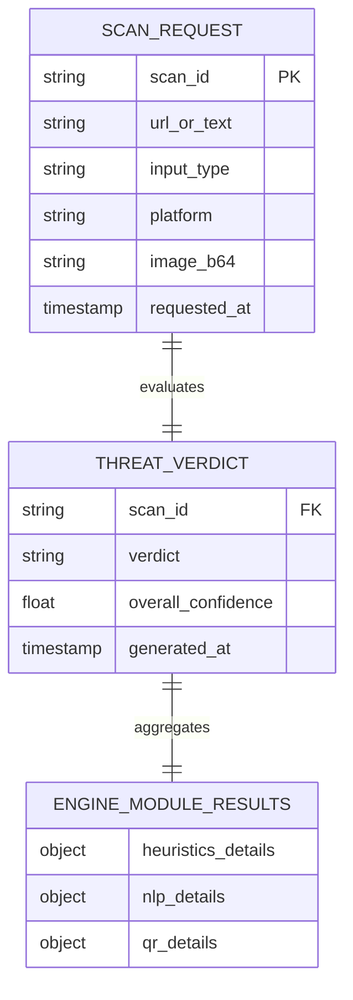
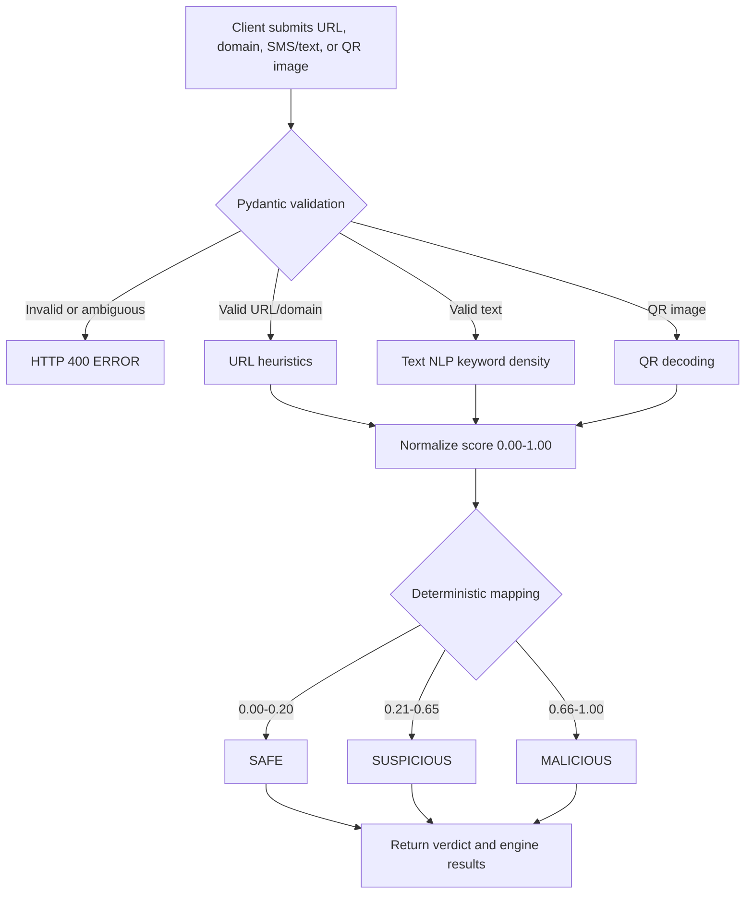

# PhishShield: Multi-Source Phishing Detection System

PhishShield is an advanced, multi-platform phishing detection ecosystem designed to detect and block malicious links across browsers, mobile applications, and QR code vectors in real-time. By utilizing a hybrid analysis engine, PhishShield combines quick heuristic filters, Natural Language Processing (NLP) brand-spoofing check pipelines, and computer vision (QR code parsing/Quishing analysis).

---

## 🛠️ Tech Stack Breakdown

- **Core Engine (Backend)**: Python, [FastAPI](https://fastapi.tiangolo.com/) (Async web framework), [Uvicorn](https://www.uvicorn.org/), [Pydantic v2](https://docs.pydantic.dev/) for data validation, [Pillow](https://python-pillow.org/) / `pyzbar` for computer vision/QR scan parsing.
- **PC Edge (Browser Extension)**: Google Chrome Manifest V3, HTML5, Vanilla CSS3, Modern ES6 JavaScript.
- **Mobile Edge (App)**: [Flutter & Dart](https://flutter.dev/) cross-platform framework, supporting custom-tailored theme profiles (Cyberpunk, OLED, Enterprise) and active HTTP api integrations.
- **Telemetry Storage**: [MongoDB](https://www.mongodb.com/) NoSQL database for caching logs, threat telemetry, and scanning statistics.

---

## 📐 Architecture & Data Relationship Overview

PhishShield uses a stateless scanning request structure. The current development backend keeps recent telemetry in memory; the database relationships below remain the planned persistence design and are not changed by the validation update.



### Database Relations
1. **`SCAN_REQUEST`**:
   - Represents the incoming link check transaction from either the Chrome Extension (PC Edge) or Flutter application (Mobile Edge).
2. **`THREAT_VERDICT`**:
   - Evaluates the submitted target and calculates `SAFE`, `SUSPICIOUS`, `MALICIOUS`, or `UNVERIFIED` with a normalized score.
3. **`ENGINE_MODULE_RESULTS`**:
   - Contains modular diagnostic outputs from:
     - *Heuristics module*: domain age, TLD risk, structure anomalies.
     - *NLP module*: brand spoofing strings, urgency indicators, semantic entropy.
     - *QR/Quishing module*: QR extraction signals, shortener/redirect checks.

### Current scan flow



---

## 🚀 Quick Start Guide

### Git and environment safety

The repository ignores virtual environments, Flutter build output, local reports, and environment files. Keep Atlas credentials in a local `.env` file or in the hosting provider's secret settings; never commit them to GitHub. The committed `.env.example` contains placeholders only.

### 1. Running the FastAPI Backend Core
Ensure you have Python 3.10+ installed.

```bash
# Navigate to the backend directory
cd phishshield/backend

# Create a virtual environment
python -m venv venv
source venv/Scripts/activate  # On Windows: venv\Scripts\activate

# Install requirements
pip install -r requirements.txt

# Start the development server
uvicorn app.main:app --host 0.0.0.0 --port 8000 --reload
```
The interactive Swagger API documentation will be available at [http://localhost:8000/docs](http://localhost:8000/docs).

### 2. Loading the Chrome Extension
1. Open Google Chrome and go to `chrome://extensions/`.
2. Enable **Developer Mode** using the toggle switch in the top-right corner.
3. Click **Load unpacked** in the top-left corner.
4. Select the `phishshield/pc-extension` directory.
5. Click on the PhishShield extension icon to scan the active tab link.

### 3. Launching the Flutter Mobile Client
Ensure you have the Flutter SDK installed and configured.

```bash
# Navigate to the mobile app directory
cd phishshield/mobile-app

# Get dependencies
flutter pub get

# Run on emulator/connected device
flutter run
```
*Note: The Flutter client is pre-configured to query `http://10.0.2.2:8000/` which is the default loopback alias pointing to your localhost on Android emulators.*
